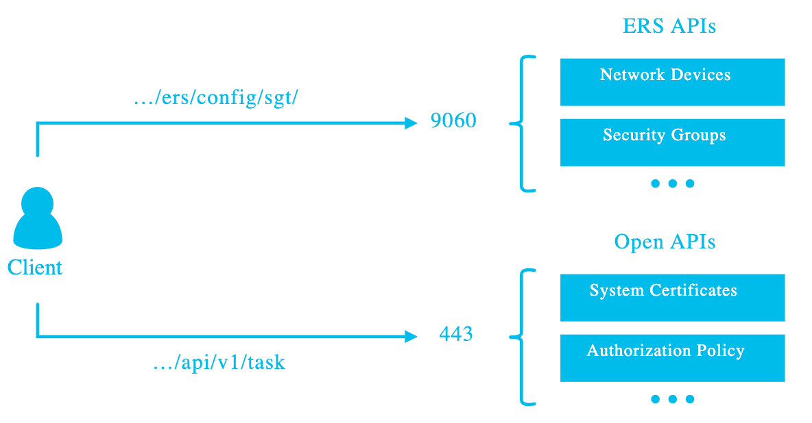
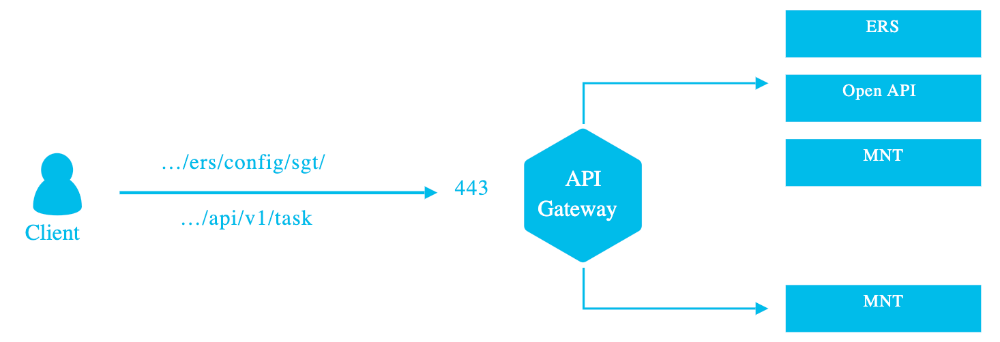
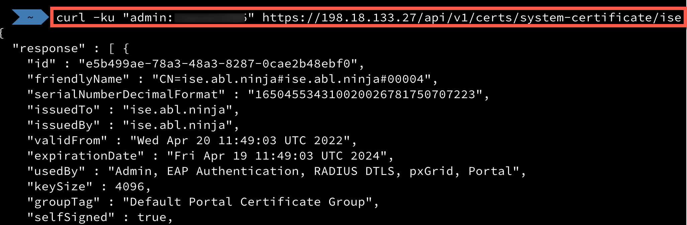

# DEVLIT-1220

# Introduction
Certificate management is a core operational task of Identity Services Engine.  It's also one of the biggest friction points in maintaining an ISE deployment because certificate management related tasks must be performed manually.  The new certificate management APIs in ISE provide an opportunity to automate these tasks, signifigantly reducing effort and risk.

Today we're going to take a look at the ISE API, briefly touch on ISE system certificate usage, then cover a couple of automation use cases.

# ISE API Primer
Pre-ISE 3.1:
1. MNT (Monitoring and Troubleshooting) - ISE 1.0
2. ERS (External Restful Services) - ISE 1.2

ISE 3.1+:
1. API Gateway for routing
2. OpenAPI

# API Gateway

The API gateway is used as an access point to route requests to different nodes and eliminates the need to use port 9060 to access the ERS API.

This screenshot from the API Settings page depicts the relationships between the API gateway and the APIs:

API Services Overivew:

API Gateway Overview:

# OpenAPI
OpenAPI is the effective replacement for ERS.  While they will continue to co-exist, all new features will be implemented in the OpenAPI service.  OpenAPI is a standardized format that makes ISE easier to work with programmatically.

The certificate APIs are part of the initial OpenAPI release, and what we're going to investigate.  

# Basic usage
ERS and Open API must be explicitly enabled. 
  Administration->system->settings->API settings->API Service settings
  
API basic usage details:

Accessing the APIs:
Authorization uses these built-in groups:
- ERS-Admin (read/write operations)
- ERS-Operator (Read-only)

API calls use Basic Authentication method

Example call using cURL:

# ISE System Certificates
ISE uses certificates for a variety of functions. with respect to those functions, there are some important considerations when thinking about what to automate.

Services have differing needs. Those needs tend to dictate certificate requirements. for our purposes we can seperate these requirements into three different buckets:

- self-signed, long lifetime (2 plus years)
  - used for ISE Interprocess communications

- internal PKI, short to intermediate lifetime (2 years max)
  - Used for product integrations and Corporate controlled endpoints

- public PKI, short lifetime (1 year max)
  - Used for guest devices or any device not enrolled in Internal PKI

A couple of important things to note:
- Replacing certificates on some system services causes a service restart
- self-signed certificates can be renewed, others must be completely replaced

# ISE Certificate API
ISE provides an extensive set of certificate Management APIs.  We're going to focus on small subset which involves:

- Get the System Certificate list
- Generate Certificate Signing Requests (CSRs)
- Bind Certificates
- Import and Export Certificates

# Example Automation Use Cases
* Disaster recovery export
* Generate certificates
* Expiring certificate check
* Replace expiring certificates (Be careful with this!)

# Conclusion
The new ISE Certificate APIs can signifigantly reduce the overhead and risk of Certificate management operations.  We presented a basic overview, covered some important considerations, and took a look at some use cases

# Resources
* [Git repository for this talk](https://github.com/srmcnutt/devlit-1220)
* Postman Collection
* ISE 3.1 DEVNET sandbox
* [Identify Services Engine on DEVNET](https://developer.cisco.com/identity-services-engine/)
* [ISE 3.1 video - APIs, Ansible, and Automation](https://www.youtube.com/watch?v=V3dnEAcywZE&t=400s)

